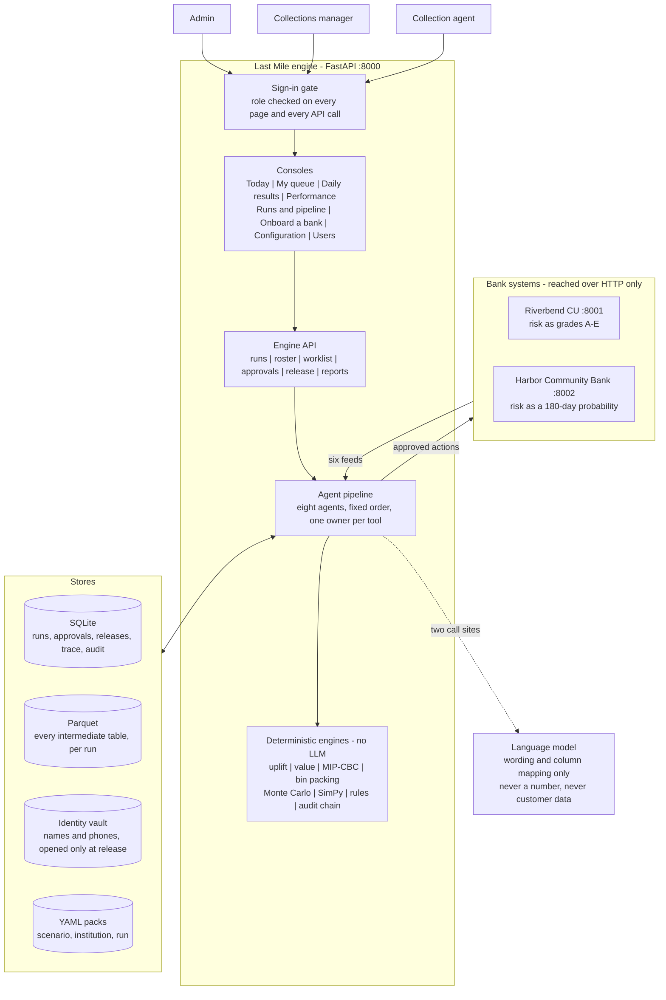

# Last Mile — agentic prescriptive analytics for collections

A bank already knows who is likely to default. This system decides **who to contact today, with what action,
and why** — using causal uplift estimates, a real MIP solver and simulation for the maths, agents for
orchestration and explanation, and a human approval gate before anything reaches a member.

Two separate applications:

| App | Port | What it is |
|---|---|---|
| `bank_api` | 8001 (Riverbend), 8002 (Harbor) | Synthetic banks. Paged JSON feeds in each bank's own column names, plus an endpoint that receives approved actions. The true effect of every action stays sealed on disk so plans can be scored honestly. |
| `lastmile` | 8000 | The decision engine, its agents, and its consoles. |

The engine talks to the bank **over HTTP only** — an import-linter contract fails the build otherwise.

---

## Contents

- [Prerequisites and OS configuration](#prerequisites-and-os-configuration)
- [Software and tools](#software-and-tools)
- [Installation](#installation)
- [Environment variables](#environment-variables)
- [Synthesised input data](#synthesised-input-data)
- [Components](#components)
- [Multi-agent collaboration](#multi-agent-collaboration)
- [Repository structure](#repository-structure)
- [Sign-in](#sign-in)
- [The consoles](#the-consoles)
- [Results — read this before presenting numbers](#results--read-this-before-presenting-numbers)
- [Known limitations](#known-limitations)
- [Acknowledgements](#acknowledgements)

---

## Prerequisites and OS configuration

Developed and run on **macOS 14+ (Apple silicon)** and **Ubuntu 22.04/24.04 (x86-64)**. Windows works
through WSL2; it is not tested natively.

| Requirement | Detail |
|---|---|
| OS | macOS 14+, Ubuntu 22.04 or 24.04, or WSL2 |
| Python | **3.11 or 3.12** (`requires-python = ">=3.11,<3.13"`). `uv` installs a matching interpreter for you. |
| Package manager | [`uv`](https://docs.astral.sh/uv/) — `curl -LsSf https://astral.sh/uv/install.sh \| sh` |
| Build tools | None. Every dependency ships a wheel; no compiler needed. |
| Disk | ~1.5 GB for the virtual environment, plus ~350 MB per fully simulated month of run artifacts |
| Memory | 2 GB is enough; the uplift fit and the 2,000-run Monte Carlo are the peaks |
| Ports | **8000** engine and consoles, **8001** Riverbend, **8002** Harbor — all bound to `127.0.0.1` |
| Network | Outbound HTTPS only if you use a hosted language model. With `LLM_PROVIDER=ollama`, or no key at all, nothing leaves the machine. |
| Solver | CBC ships inside the `pulp` wheel. No separate install. |

On a server, keep 8000–8002 on loopback and put a reverse proxy with TLS in front. `docs/DEPLOYMENT_GUIDE.md`
covers the options; `scripts/deploy.sh` is the script used for the EC2 deployment.

---

## Software and tools

Exact versions are pinned in **`uv.lock`**, and `uv sync --frozen` reproduces that resolution byte for byte
on any machine. The constraints below are what the project declares.

| Library | Constraint | Used for |
|---|---|---|
| `fastapi` | `>=0.110` | Both HTTP apps and every console route |
| `uvicorn` | `>=0.29` | ASGI server |
| `httpx` | `>=0.27` | The bank client — the only way the engine reaches a bank |
| `pandas` | `>=2.1` | Every table between ingestion and the plan |
| `numpy` | `>=1.26` | Numeric work under the models and simulators |
| `pyarrow` | `>=15` | Parquet artifacts, one folder per run |
| `pydantic` | `>=2.6` | Config-pack schemas and API models; invalid config fails before a run starts |
| `pyyaml` | `>=6` | The three YAML packs |
| `numexpr` | `>=2.9` | Evaluates value expressions over named columns — arithmetic only, never `eval()` |
| `scikit-learn` | `>=1.4` | `HistGradientBoostingClassifier` in the bagged T-learner; the propensity model in the feasibility check |
| `pulp` | `>=2.8,<4` | Mixed-integer program, solved by the bundled **CBC**. Capped below 4 because PuLP 4 removes `PULP_CBC_CMD`. |
| `simpy` | `>=4.1` | Discrete-event simulation of a collector's shift |
| `python-dotenv` | `>=1.0` | Loads `.env` |

Development only: `pytest>=8`, `ruff>=0.4`, `import-linter>=2.0`.

No proprietary SDK is required. The only optional external service is a hosted language model, and the
system runs fully without one.

---

## Installation

```bash
git clone https://github.com/Anandh-Andrews-ZS0335/kamat.git
cd kamat

make setup      # uv creates the venv, installs pinned deps, writes a starter .env
make seed       # generate both synthetic banks (~1s)
make users      # create bootstrap accounts; prints passwords ONCE and the .env lines
make up         # Riverbend :8001 + Harbor :8002 + engine & consoles :8000
```

Paste the `LASTMILE_USERS` and `LASTMILE_SESSION_SECRET` lines that `make users` prints into `.env`, then
restart. Open **http://127.0.0.1:8000/guide** for the guided tour, or `/manager` to run a business day.

Verify the install:

```bash
make test       # 78 tests
make lint       # ruff + the three architecture contracts
```

Other targets: `make run` (one run from the terminal), `make evaluate RUN=run_...` (score a run against
sealed truth), `make clean-runs`.

---

## Environment variables

All have a working default for local development except the two marked required. `.env` is gitignored and
must never be committed.

| Variable | Default | What it does |
|---|---|---|
| `LASTMILE_USERS` | *(none)* | **Required to sign in.** Bootstrap accounts as `user:role:hash;user:role:hash`. Roles: `admin`, `manager`, `collector`. Generate with `make users`. |
| `LASTMILE_SESSION_SECRET` | *(none)* | **Required.** HMAC key signing the session cookie. Random per environment. |
| `LASTMILE_TOKEN_SECRET` | `dev-only-token-secret-change-me` | HMAC key that turns account and member ids into tokens. **Change it outside development** — it is what keeps the analytics store free of real identifiers. |
| `BANK_API_URL` | `http://127.0.0.1:8001` | Riverbend Credit Union base URL |
| `HARBOR_COMMUNITY_BANK_API_URL` | `http://127.0.0.1:8002` | Harbor Community Bank base URL |
| `LASTMILE_CONFIG_DIR` | `./config` | Where the three YAML packs live |
| `LASTMILE_DATA_DIR` | `./data/engine` | SQLite, Parquet artifacts, identity vault, cached models |
| `BANK_DATA_DIR` | `./data/bank` | The synthetic bank's own database |
| `LLM_PROVIDER` | `gemini` | `gemini` or `ollama`. Anything else falls back to deterministic templates. |
| `GEMINI_API_KEY` | *(empty)* | Without it the run uses templates and the consoles say so |
| `GEMINI_MODEL` | `gemini-2.5-flash` | |
| `OLLAMA_BASE_URL` | `http://127.0.0.1:11434` | Also reads `OLLAMA_HOST` |
| `OLLAMA_MODEL` | `llama3.2` | |
| `LLM_TIMEOUT_S` | `45` | Per-call timeout |

A note if you script against `.env`: `LASTMILE_USERS` contains `;` separators, so `source .env` will try to
execute part of it. systemd's `EnvironmentFile=` reads it correctly; a shell does not.

---

## Synthesised input data

**No customer data, real or synthetic, is committed.** `data/` is gitignored. The data is *generated*, and
the generator is in the repository — which makes it reproducible rather than merely available:

```bash
make seed
```

That builds both banks from fixed seeds. The same command on any machine produces **byte-identical** data,
so a result quoted from one laptop can be reproduced on another. Approximate scale:

| Bank | Members | Accounts | Delinquent | Queue history | Matured outcomes | Risk score |
|---|---|---|---|---|---|---|
| Riverbend Credit Union | 2,500 | 5,188 | 1,514 | 20,308 rows | 16,322 rows | grades A–E |
| Harbor Community Bank | 3,000 | — | — | — | — | 180-day probability |

Custom sizes: `uv run python -m bank_api --members 5000 --days 180 --seed 42`.

The generator also seals the **true causal effect** of every action on every account in a file the engine
never reads. That is what makes `make evaluate RUN=...` possible: plans are scored against ground truth,
which cannot be done on a real portfolio.

The 54 fields the engine consumes, and what each one decides, are catalogued in
`docs/architecture/data-inventory.html`.

---

## Components



---

## Multi-agent collaboration

Eight agents run in a fixed order under a Supervisor. **Tool ownership is enforced**: an agent that calls a
tool it does not own is refused, and the refusal is traced. The Policy Agent appears twice on purpose — once
as a gate before anything is scored, once as an independent re-check of the finished plan.

```mermaid
flowchart TB
  SUP(["Supervisor Agent - orders every stage, records the trace, publishes the worklist"])

  CFG["<b>1 Configuration Agent</b><br/>config.load_packs | config.map_fields | roster.load<br/><i>produces:</i> resolved config and hash, capacity per collector"]
  ING["<b>2 Ingestion Agent</b><br/>bank.health | bank.list_feeds | bank.fetch_feed | landing.store<br/><i>produces:</i> a raw snapshot of six feeds"]
  DS["<b>3 Data Steward Agent</b><br/>quality.run_gates - 13 gates | privacy.tokenise | features.feasibility_profile<br/><i>produces:</i> tokenised tables, personal data in the vault"]
  FEA["<b>4 Feature Agent</b><br/>features.calibrate_pd | lookup_lgd | join_portfolio<br/>build_training_set | build_online_features | leakage_guard<br/><i>produces:</i> PD, exposure, LGD, point-in-time features"]
  POL["<b>5 Policy Agent</b><br/>policy.eligibility<br/><i>produces:</i> the actions each account is allowed"]
  DEC["<b>6 Decision Agent</b><br/>kpi.validate_uplift | engine.train_uplift | score_actions | assign_segments<br/>compute_value | optimise | assign_collectors | simulate_policies | simulate_floor<br/><i>produces:</i> account to action to collector, with a queue position"]
  POL2["<b>7 Policy Agent, again</b><br/>policy.verify_plan | governance.escalate | audit.append<br/><i>produces:</i> a clean verdict, or the run fails closed"]
  EXP["<b>8 Explanation Agent</b><br/>provenance.build_facts | llm.draft_templates<br/>provenance.validate_templates | engine.explain_selection | worklist.publish<br/><i>produces:</i> a sourced reason for every recommendation"]

  HUM{{"Collections manager<br/>approves, edits or rejects each item, then releases"}}
  AGT{{"Collection agent<br/>works their own queue, records what happened"}}
  BANK[("The bank<br/>executes, then confirms the outcome at 30 days")]

  SUP -.-> CFG
  CFG --> ING
  ING --> DS
  DS --> FEA
  FEA --> POL
  POL --> DEC
  DEC --> POL2
  POL2 --> EXP
  EXP --> HUM
  HUM --> AGT
  AGT --> BANK
  BANK -->|"matured outcomes become the next training set"| DEC

  ONB["<b>Onboarding Agent</b> - runs once per new bank<br/>onboard.read_api_description | llm.onboard_plan | onboard.sample_feeds<br/>onboard.profile_data | llm.onboard_map | onboard.check_proposal | onboard.build_pack"]
  ONB -.->|"an admin approves the proposed pack"| CFG
```



Sequencing is deterministic, so runs are reproducible and auditable.

---

## Repository structure

```
kamat/
├── config/                         LAYER 0 — the only thing that changes per scenario / client
│   ├── scenarios/                  what decision: objective, actions, causal target, features
│   │   ├── collections_delinquency.yaml
│   │   └── npa_early_warning.yaml   a second decision on the same engine (validates; needs a loan feed to run)
│   ├── institutions/               whose data and policy: field map, calibration, LGD, capacity, rules
│   │   ├── riverbend_cu.yaml
│   │   └── harbor_community_bank.yaml
│   └── runs/                       today's parameters
├── src/
│   ├── bank_api/                   separate app: the synthetic banks and their REST APIs
│   │   ├── generator.py            deterministic data, day-by-day simulation, sealed true effects
│   │   ├── main.py                 Riverbend  (/api/v1/...)
│   │   └── harbor.py               Harbor     (/v2/...), renamed columns, probability scores
│   └── lastmile/
│       ├── config/                 L0 loader: Pydantic schemas, structured rules, hashing, field docs
│       ├── store/                  SQLite (runs, trace, recommendations, approvals, audit) + Parquet
│       ├── ingest/                 HTTP bank client, field mapping, quality gates, tokenisation, onboarding
│       ├── features/               PD calibration, LGD, point-in-time features, leakage guard, feasibility
│       ├── engine/                 uplift, value, segments, optimiser, packing, Monte Carlo, SimPy — no LLM
│       ├── governance/             policy, escalation, audit chain, approvals, release, attempt outcomes
│       ├── kpi/                    pure metric functions (Qini, uplift by decile)
│       ├── agents/                 registry, trace, tools, the eight agents, onboarding agent, provenance, LLM clients
│       ├── pipeline/               run entry points, re-plan
│       └── api/                    FastAPI routes + the static consoles
├── scripts/
│   ├── dev.py                      start every app
│   ├── simulate_days.py            operate N business days end to end, so outcomes exist
│   ├── deploy.sh                   ship to the server and restart both services
│   └── evaluate_against_truth.py   the only non-test code that reads sealed truth
├── tests/                          78 tests — claims, auth and scoping, the business day, onboarding, KPIs
├── docs/
│   ├── architecture/               solution architecture, data inventory, review answers (.html)
│   ├── testing/                    manual test plan for a tester (PDF)
│   └── DEPLOYMENT_GUIDE.md
└── data/                           generated by `make seed` — gitignored, never committed
```

Architecture is enforced by `make lint` (import-linter): layers point downward, `engine`/`features`/
`governance`/`kpi` may not import `agents`, and `lastmile` may not import `bank_api`.

---

## Sign-in

Every console and API call requires a login. `make users` creates bootstrap accounts with random passwords
and prints the `LASTMILE_USERS` / `LASTMILE_SESSION_SECRET` lines for `.env` (restart to apply):

| Role | Can do |
|---|---|
| `admin` | everything, including onboarding a bank, saving configuration and creating accounts |
| `manager` | team, runs, approve / edit / reject, release, close the day; adds collection agents |
| `collector` | one roster-linked queue; may re-order their own work before release and record what happened, but cannot approve or release |

Signing in sends each role to a page it can actually open: a collection agent lands on their queue,
everybody else on the guided tour.

Roster-linked collection-agent accounts are created from **Users & access** (`/admin/users`) using the
collector ID from the daily team, such as `C01`. An admin can create any role there; a manager is offered
collection agents only, and sees only their own agents in the list — the cap is enforced in the API, not
just in the form. Approvals, releases, team changes, day closures and configuration saves are all recorded
under the signed-in username.

Serve it over HTTPS when it leaves your machine: passwords and the session cookie must not travel in clear text.

### One worklist, scoped on the server

`GET /api/worklist` answers both consoles. The signed-in session decides whose rows come back — a collection
agent always gets their own queue, and a `collector=` parameter from the browser is discarded rather than
honoured — and the scope also decides which *fields* are sent. A collector's payload carries no expected
value, no uplift, no segment label and no risk grade: those are the manager's frame, and a price tag or a
"Lost Cause" label on screen would change how the person on the phone is spoken to. The response also
carries a `can` block, and both pages render from that rather than from a role name, so adding a role later
is a server-side change.

---

## The consoles

`/manager`, `/report`, `/kpis`, `/admin`, `/admin/config`, `/admin/users` and `/agent` share one application
shell (`static/app.css`, `static/shell.js`). Navigation follows each role's workflow: administrators set up
banks, configuration and users; managers run the business day; collection agents work only their assigned
queue. The shell shows the page title, business date, bank and LLM status, configuration hash, and a user
menu with a light/dark/system theme switch. The client-facing pages (`/guide`, `/demo`) keep their own
presentation layout.

### The manager's business day (`/manager`)

The top of the Manager Console walks through the day, and nothing moves on its own:

1. **Confirm today's team** — who is working and for how long. Saved per day, carried forward, audited.
   The institution pack's `capacity.agents × minutes_per_agent` is only the default.
2. **Start today's run** — the planner fills **one queue per collector**, each to 90% of that person's shift
   (`capacity.planning_buffer`). Texts go to an automated queue.
3. **Review and approve.** If the team changes after the run, **Re-plan** reuses the day's data and model and
   plans again in seconds; the old worklist is marked *superseded*.
4. **Release** approved actions to the bank.
5. **Close the day** — freezes the daily report (`/report?date=`) and, on the simulated bank, runs the bank's
   business day: released actions execute, new accounts fall behind, matured outcomes appear.

### The collection agent's queue (`/agent`)

Only the accounts assigned to that person today, in the optimiser's order. They may re-order their own queue
until the manager releases it, and once an action has gone out they record what happened — reached, promise
to pay with a date, no answer, wrong number, refused, hardship — with a comment. Corrections append rather
than overwrite, so the note made at the time survives an edit.

### Business KPIs (`/kpis`)

Seven questions for a business analyst, each with how it is measured, where the numbers come from and how far
to trust it. Outcomes appear 30 days after an action; until then days show as waiting. There is no random
holdout yet, so results are shown as observed, not caused.

To see it with data on the simulated bank, operate some business days:

```bash
uv run python scripts/simulate_days.py --days 35 --yes
```

### Onboarding a new bank (`/admin/onboarding`)

Banks run different predictive models and name their endpoints and columns their own way. The **Onboarding
Agent** works that out, and its brain is the language model:

1. reads the bank's published API description (`/openapi.json`)
2. **the model decides** which endpoint is the status check, the catalogue, each of the six feeds and the action receiver
3. samples 300 rows per feed and profiles them privately — kinds, ranges, code values, and only the *shape* of
   names, phones and ids, so no customer data reaches the model
4. **the model decides** which bank column is which Last Mile field, what the risk score is (`band` or
   `probability`, over how many days), and which fields are personal
5. deterministic checks test that answer against the real data; failures go back once with the exact problems
6. an admin approves: the packs are saved, then **Run a test day** runs the full pipeline

Business rules an API cannot reveal (LGD table, capacity, contact policy, eligibility, escalation, reason
codes) are copied from Riverbend and listed for confirmation with the bank. Every prompt and response is
stored in `llm_calls`.

**Demo bank:** Harbor Community Bank on port 8002 sends 180-day default probabilities under `/v2/...` paths
with its own column names. The model mapped all 54 fields correctly on the first attempt and a full test day
completed — with **no engine code different** between the two banks.

### Configuration editor (`/admin/config`)

Edit the three YAML packs in the browser. A guide beside the editor explains each section, which agent reads
it and what changes if you edit it. **Check changes** applies the same validation a run does and points at
the line. Saving needs a reason, keeps the previous version (`config/.history/`), writes an audit event, and
takes effect from the next run. Saving is refused while a run is in progress.

### The language model

Only two places use one: the Explanation Agent drafts rationale and script **templates** per segment × action,
and the Onboarding Agent proposes a column mapping. Neither is sent account data, and neither is allowed to
write a number.

```bash
# hosted
LLM_PROVIDER=gemini
GEMINI_API_KEY=your-key
GEMINI_MODEL=gemini-2.5-flash

# or local, nothing leaves the machine
LLM_PROVIDER=ollama
OLLAMA_MODEL=llama3.2
OLLAMA_BASE_URL=http://127.0.0.1:11434
```

The consoles show a **vendor-neutral** label — `llm` when a model wrote the wording, `template (…)` when the
deterministic fallback did — because which vendor answered is not an operator's concern. The exact provider
and model are written to `llm_calls` on every call, so an auditor can always tell.

With no key the run uses deterministic templates and the consoles say so. Every template — model-written or
built-in — is validated; any digit outside a `{{placeholder}}` is rejected. To add a provider, write a class
satisfying `lastmile.agents.llm.base.LLMClient` and select it in `lastmile/agents/llm/factory.py`. No agent
changes.

---

## What happens in a run

| # | Stage | Accountable agent | Tools (module) |
|---|---|---|---|
| 1 | Data ingestion | Ingestion Agent | `bank.health`, `bank.list_feeds`, `bank.fetch_feed` (HTTP), `landing.store` |
| 2 | Configuration | Configuration Agent | `config.load_packs` (validate + hash 3 packs), `config.map_fields`, `roster.load` |
| 3 | Data quality & privacy | Data Steward Agent | `quality.run_gates` (13 gates), `privacy.tokenise` (HMAC tokens, PII vault) |
| 4 | Feature layer | Feature Agent | portfolio join, PD calibration, LGD, point-in-time training set, online features, leakage guard |
| 5 | Decision engine | Decision Agent | holdout validation (Qini), bagged T-learner, action scoring, value (numexpr), segments, **CBC MIP**, packing, baselines, Monte Carlo, SimPy |
| 6 | Policy & governance | Policy Agent | eligibility gate, independent post-solve verification, escalations, hash-chained audit |
| 7 | Explanation | Explanation Agent | stamped facts, template drafting, template validation, counterfactual re-solve |
| 8 | Human approval | Supervisor → Collections manager | publish worklist; approve / edit / reject; release to bank |

---

## Results — read this before presenting numbers

The synthetic bank lets us score plans against the true effects, which is impossible on a real portfolio.
`Manager Console → Sort vs Optimised → Run synthetic benchmark` shows it for any run.

On the default seed, same capacity and policy for every plan:

| Plan | True avoided loss |
|---|---|
| Sort by risk grade | ≈ $68.7k |
| Sort by expected loss | ≈ $91.5k |
| **Optimised (uplift + CBC)** | **≈ $86.9k** — +26% vs risk sort, −5% vs expected-loss sort |
| Oracle (true uplift) | ≈ $131.5k |

- The optimiser clearly beats working the list **by risk**, and takes fewer actions that truly harm (63) than
  either sort (76–82).
- It narrowly **loses to a well-built expected-loss sort** here. The limit is account-level uplift ranking
  (correlation with truth 0.23–0.48), notably within the CALL arm. Bagging, shrinkage, pooling, AIPW
  calibration, a longer history and blending towards average effects were all tested; none closed the gap,
  and choosing among them on sealed truth would overfit.
- The model is optimistic: estimates run ≈2× the true value. Treat estimated dollars as relative.

Levers that should move this on real data: a randomised holdout, more treatment history per action, and
features that identify contact-sensitive members.

---

## Known limitations

- **No randomised holdout.** Recovery figures are observed, not proven to be caused by the system. This is the
  single most valuable thing to add next.
- Static member traits (e.g. PTP kept rate) are read as today's values in training — a stated simplification.
- PD horizon conversion assumes constant hazard.
- Hardship referrals are rarely chosen: payment plans dominate them per agent-minute under the current effects.
- The NPA scenario pack loads and validates; running it end to end needs a loan-level feed from the bank.
- What a collection agent records is stored but not yet read back as model features, so the same-day half of
  the feedback loop is captured but not closed. The 30-day loop runs.
- The optimiser records CBC's solve status but does not yet fail closed on a non-optimal result.
- Complaints and opt-outs arrive as 12-month totals rather than dated events, which limits the customer-impact KPI.

---

## Acknowledgements

Built on open source, with thanks to the maintainers of:

[FastAPI](https://fastapi.tiangolo.com/) and [Starlette](https://www.starlette.io/) ·
[Uvicorn](https://www.uvicorn.org/) ·
[Pydantic](https://docs.pydantic.dev/) ·
[HTTPX](https://www.python-httpx.org/) ·
[pandas](https://pandas.pydata.org/) ·
[NumPy](https://numpy.org/) ·
[Apache Arrow / PyArrow](https://arrow.apache.org/) ·
[scikit-learn](https://scikit-learn.org/) ·
[PuLP](https://coin-or.github.io/pulp/) and the [COIN-OR CBC](https://github.com/coin-or/Cbc) solver ·
[SimPy](https://simpy.readthedocs.io/) ·
[NumExpr](https://numexpr.readthedocs.io/) ·
[PyYAML](https://pyyaml.org/) ·
[python-dotenv](https://github.com/theskumar/python-dotenv) ·
[SQLite](https://www.sqlite.org/) ·
[uv](https://docs.astral.sh/uv/) and [Ruff](https://docs.astral.sh/ruff/) ·
[import-linter](https://import-linter.readthedocs.io/) ·
[pytest](https://docs.pytest.org/) ·
[Mermaid](https://mermaid.js.org/) ·
[IBM Plex](https://www.ibm.com/plex/) ·
[Caddy](https://caddyserver.com/) ·
[Ollama](https://ollama.com/)

The uplift approach follows the standard T-learner formulation from the causal-inference literature; the Qini
coefficient is the usual uplift ranking metric.
